= Documation Technique
:toc: macro
:toc-title: Table des matières
:toclevels: 3

:hide-uri-scheme: 

== Introduction

Cette documentation a pour but de lister le fonctionnement du site web dans le cadre de futurs projets de développement. Vous retrouverez dans cette documentation les fonctionnalités listées et détaillées, ainsi que leur fonctionnement.

toc::[]

== Architecture Code Igniter 4

Code Igniter 4 utilise le modèle MVC (Modèle Vue Contrôleur).

image::images/Archi_racine.png[structure_racine]

Dans le projet, on retrouve 5 parties :

* La première est la configuration du projet Code Igniter avec le fichier .env à modifier pour le fonctionnement de votre site.

* La deuxième est les writables, ils stockent toutes les informations liées à des problèmes.

image::images/Archi_racine_2.png[structure_racine]

* Le troisième est le système. Tout le fonctionnement du site est contenu dedans.

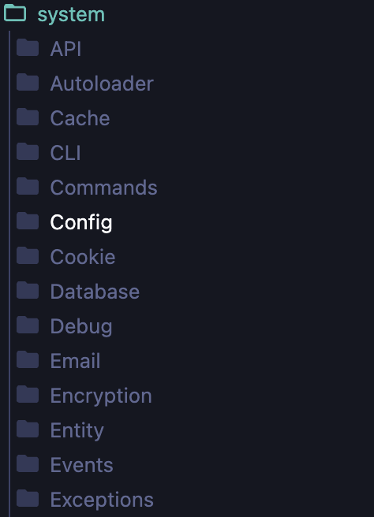

* Le quatrième est le dossier public. Dans celui-ci, on peut retrouver les fichiers css, js ou tout autre langage utilisé.

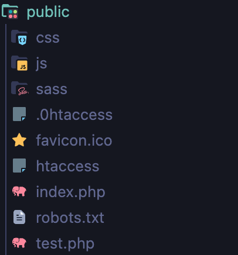

* Le dernier est app, dans celui-ci on retrouve toute l'application, les vues, les contrôleurs et les modèles.

image::images/Archi_racine_5.png[structure_racine]

Rentrons dans app pour voir en détail l'application.

image::images/Archi_racine_5.png[structure_app]

Dans app, on retrouve plusieurs dossiers, mais nous allons nous focaliser sur certains dossiers en particulier.

* Le dossier config, où vous pourrez paramétrer l'application et définir les routes de votre projet. L'application utilise énormément les routes. Grâce à elles, on peut se déplacer dans l'application et réaliser des actions.

image::images/Archi_app_1.png[structure_app]

* Le dossier contrôleur, où on trouve les contrôleurs qui permettent la gestion des vues. Les contrôleurs importent les méthodes qui sont définies dans les modèles.

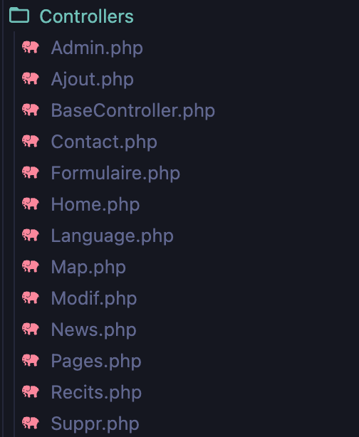

* Le dossier modèle, où il y a tous les modèles de méthodes. On y retrouve des méthodes de requête en base de données ou de récupération de données qui seront appliquées dans les contrôleurs.

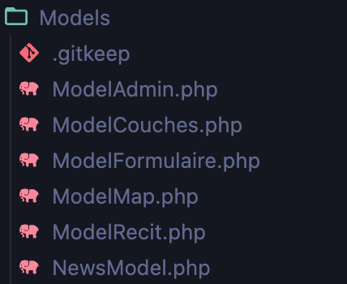

* Le dossier langage, où on trouve la traduction de tous les champs affichés du site. Actuellement, il y a la version française et anglaise.

image::images/Archi_app_4.png[structure_app]

* Le dossier views qui stocke toutes les pages du site web, rangées dans des dossiers. Le dossier templates contient les pages pour le footer et la sidebar. Le dossier reclaves, quant à lui, contient toutes les autres pages du site web ainsi que le header.

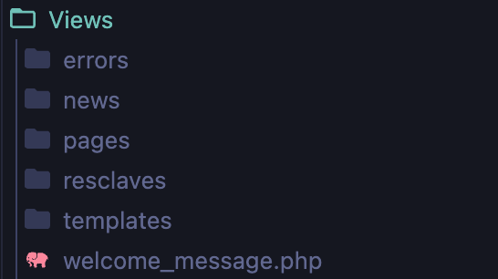

== Base de données

Voici la documentation technique pour la base de données liée au site web.

=== Autoch2

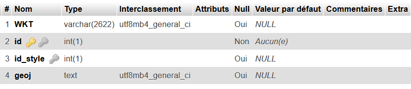

Cette table contient des polygones en Amérique.

=== Fullpt_1

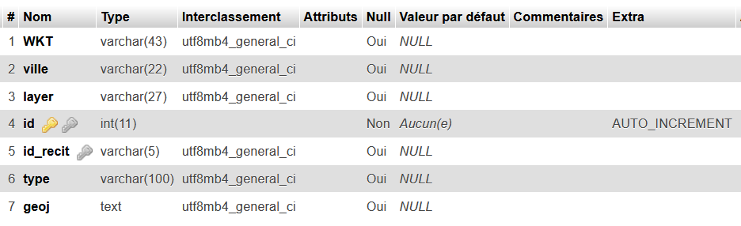

Cette table contient des points.

=== Link

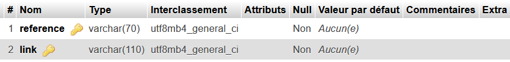

Cette table contient des liens pour les récits.

=== Map3

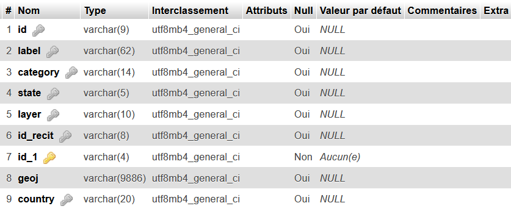

Cette table contient des polygones.

=== Page

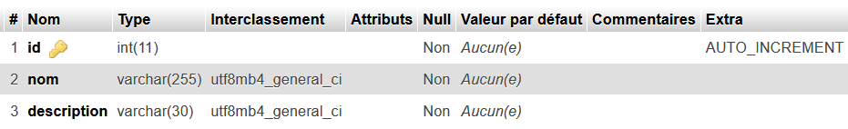

Cette table liste toutes les pages du site web.

=== Points

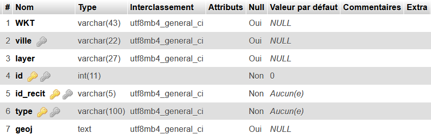

Cette table contient les points liés aux récits.

=== Polygone

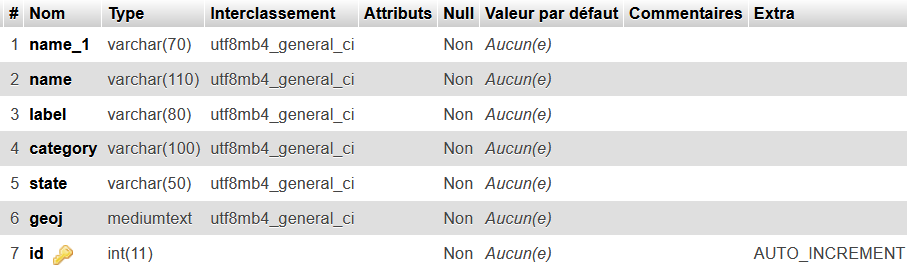

Cette table contient les polygones liés aux récits.

=== Pts_publication

image::images/ptspubli.png[ptspubli]

Cette table contient les points de publication.

=== Recit_poly

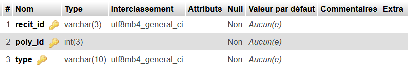

Cette table contient les liens entre les polygones et les récits.

=== Roy_afr

image::images/royafr.png[royafr]

Cette table contient les polygones des royaumes africains.

=== Tab_auteurs

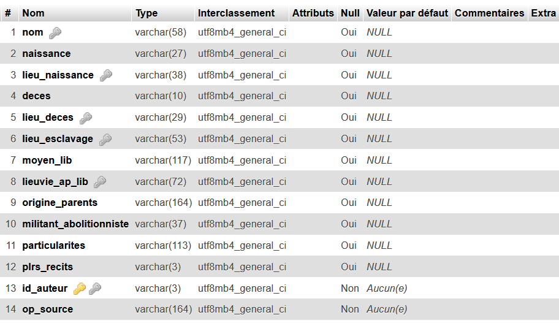

Cette table contient les auteurs du site web.

=== Tab_recits_v3

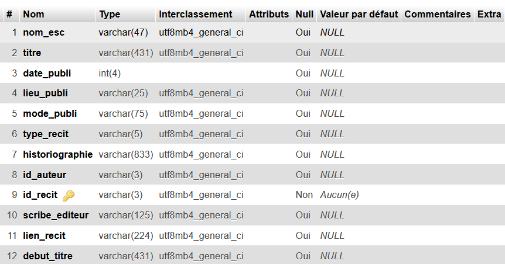

Cette table contient les récits du site.

=== User

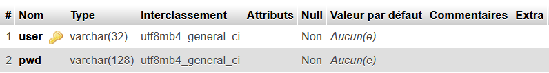

Cette table contient les utilisateurs pour se connecter.

=== Visite

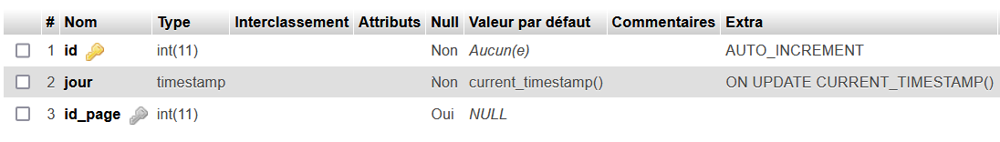

Cette table liste les connexions aux pages pour les statistiques de visite.

Maintenant que vous avez vu la structure du projet, passons aux fonctionnalités.

== Accueil

=== Map
L'accueil est la page principale du projet, elle redirige vers la plupart des fonctionnalités du site web.

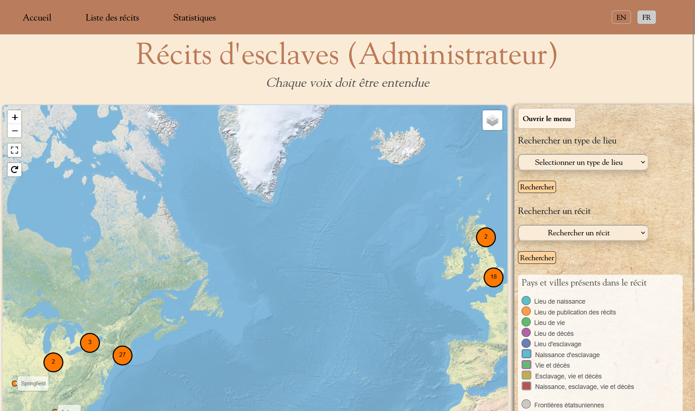

`Accueil` correspond à la page `accueil.php`.

La carte correspond à :

image::images/accueil_map_code.png[accueil]

Voici le code JavaScript pour ajouter les cartes à la page. Ensuite, on retrouve l'ajout de boutons pour manipuler la map, la légende, et enfin l'ajout de cercles. L'image ne contient que la récupération des maps.

`Accueil.php` ne contient que la carte; la sidebar à droite vient de la page `sidebar.php`.

== Header

image::images/header.png[header]

Le fichier est `header_resc.php`.

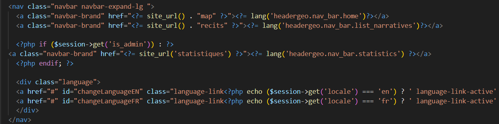

On y retrouve une barre de navigation (`navbar`) avec :

* `Accueil` qui renvoie vers la map en utilisant la route `map`
* La liste des récits avec la route `recit`
* Statistiques avec sa route.

De plus, on y retrouve le code pour définir la langue du site.

image::images/header_code_lang.png[header]

Le script JavaScript est utilisé lorsque le bouton est cliqué, et il va faire une recherche dans le dossier `language`, ici en anglais.

=== Accueil

Quand on clique sur `Accueil` dans le header, voici comment le code va exécuter cette action.

image::images/header_accueil_1.png[lien]

Quand `Accueil` est cliqué, il va chercher la route `map`.

image::images/header_accueil_2.png[route]

La route lui indique qu'il doit exécuter la méthode `index` de la classe `Map` (contrôleur Map).

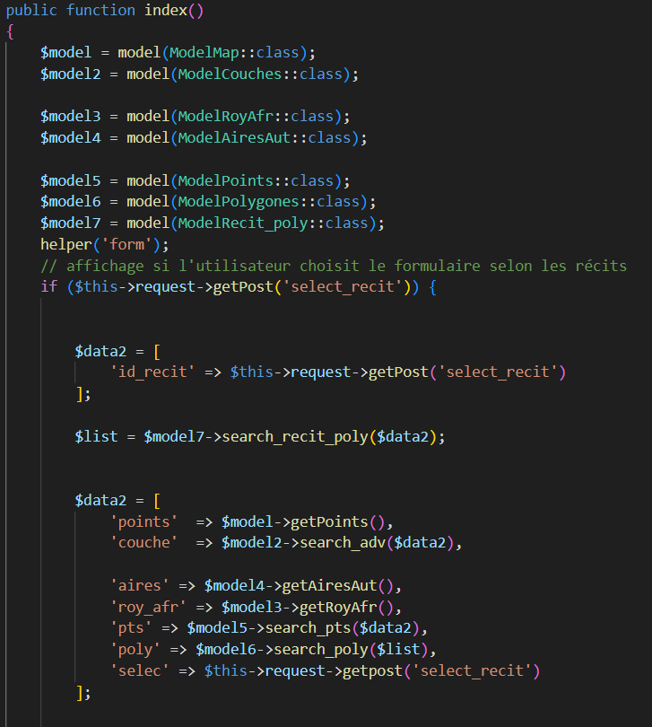

Il va importer les méthodes des modèles et les utiliser. Il teste si un des formulaires dans le sidebar est rempli, sinon il va faire l'affichage de base.

image::images/header_accueil_5.png[traitement de base]

Il va exécuter la méthode `getPoints` du modèle `Map`.

image::images/header_accueil_méthode.png[méthode getpoint]

Il va lier la table `tab_recit_v3` et `point` par leur `id_recit` et va retourner toutes les lignes dans `point` qui ont l'attribut `type` égal à `publication`. Les attributs des lignes récupérées par la requête seront égaux à la définition de `allowedFields` au-dessus de la méthode. Si un attribut n'est pas dans `allowedFields`, il ne sera pas récupéré.

image::images/header_accueil_4.png[return]

Puis il va retourner les vues pour les afficher.

=== Liste Récit

Lorsque l'on clique sur `Liste des récits`, 

il va chercher la route `recit`.

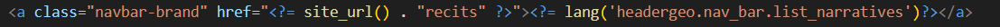

La route lui indique qu'il doit utiliser la méthode `index` du contrôleur `Recits`.

image::images/header_recit_2.png[route]

La méthode effectue tout d'abord des requêtes pour connaître l'ordre de tri des récits.

image::images/header_recit_3.png[méthode]

Ensuite, elle effectue des requêtes pour rechercher les récits dans `tab_recit_v3`.

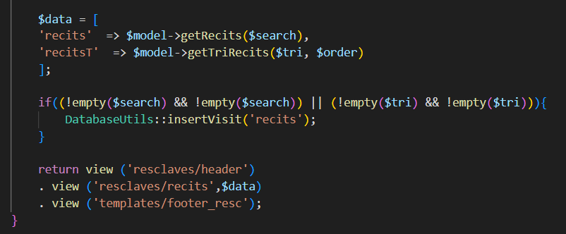

image::images/header_recit_4.png[méthode]

Et enfin, elle retourne les vues pour les afficher (`recits.php`).

image::images/header_recit_6.png[liste recit]

Le tableau affiche les récits, avec pour chaque ligne, un lien vers le récit en détail, ainsi que des possibilités de modification et de suppression des récits depuis la liste.

==== Récit

==== Modification Récit

image::images/header_recit_modif_1.png[lien]

Chaque ligne `modifier` a pour lien `modif_recit` suivi des informations sur le récit sélectionné.

image::images/header_recit_modif_2.png[route]

La route appelle la méthode `modif` du contrôleur `Modif`.

image::images/header_recit_modif_3.png[méthode]

La méthode récupère toutes les informations des récits, puis affiche la page de modification du récit avec un formulaire pour chaque champ.

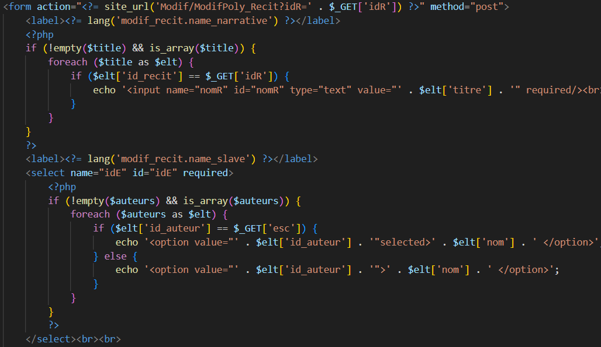

Elle va remplir les champs en parcourant les résultats de la méthode lorsque l'id du récit est égal à l'id du récit venant de l'URL.

Une fois cela fait, dès que l'on valide le formulaire, celui-ci utilise la route `Modif/ModifPoly_Recit`.

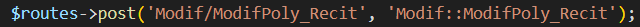

La route renvoie vers la méthode `ModifPoly_Recit` du contrôleur `Modif`.

image::images/header_recit_modif_6.png[méthode]

La méthode va récupérer tous les champs du formulaire.

image::images/header_recit_modif_7.png[méthode]

Puis effectuer les traitements dans la base de données. Elle va modifier le récit avec les informations, supprimer les lignes dans `recit_poly` qui sont égales à l'id du récit, puis réinsérer dans la base de données les liaisons entre les polygones et les récits. Elle affichera ensuite la liste des récits.

==== Suppression Récit

image::images/header_recit_suppr_1.png[code]

Lors du clic sur le lien il va cherché la route "Suppr/SupprRecit" et demandé  avec une pop up une confirmation de la volonter de supprimer le récit.

image::images/header_recit_suppr_2.png[route]

la route va appeller la méthode SupprRecit du controlleur Suppr(Suppr.php)

image::images/header_recit_suppr_3.png[méthode]

La méthode va supprimer tout les points liées au récit ainsi que le récit et les liaisons être les récits et les polygones. Puis va afficher la liste des récits.

==== Récit en Détail

image::images/header_recit_recit_1.png[listeRecit]

Lorsqu'on clique sur un récit dans la liste, le formulaire appelle la route recits/ + l'id du récit.

image::images/header_recit_recit_2.png[route]

La route appelle la méthode view du contrôleur Recits.

image::images/header_recit_recit_3.png[méthode1]

La méthode récupère les informations du récit sélectionné dans les paramètres puis fait une recherche de toutes les informations liées au récit en paramètre. Puis le champ "historiographie" est récupéré à part pour être modifié.

Et enfin, on définit un pattern () et on récupère toutes les occurrences où il y a des parenthèses.

image::images/header_recit_recit_4.png[méthode2]

Pour chaque occurrence des parenthèses, on va diviser le texte avec comme séparateur la virgule, et l'affecter à $segments.

Si le segment a trois éléments, cela veut dire que dans la parenthèse on retrouve (Auteur, Titre raccourci, page). Puis on veut récupérer chaque élément et on va générer un string qui appelle la fonction javascript permettant de récupérer les infos de Zotero.

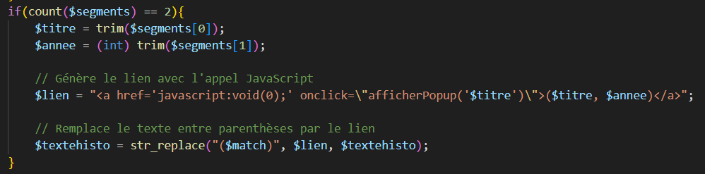

Si le nombre d'éléments est égal à 2, cela veut dire qu'il y a le (Titre, page). Mais le principe reste le même.

image::images/header_recit_recit_6.png[méthode6]

Si le nombre d'éléments dans la parenthèse est égal à 1, cela veut dire que c'est un lien et donc on va récupérer les liens stockés dans la table Link. Si le lien existe, il va modifier les pour mettre le lien. Sinon, il ne change rien.

image::images/header_recit_recit_7.png[méthode7]

Puis il affiche la page view avec les informations du récit.

=== Affichage d'un récit

Dans la page on retrouve toutes les informations liées au récit sélectionné.

==== Ajout d'un lien

Mais on trouve aussi la possibilité de modifier et supprimer le récit depuis cette page. Mais le principal est une possibilité d'ajouter des liens dans la BD.

image::images/header_recit_view_1.png[lien]

Lors du clic sur le lien, la route appelle "/ajout link".

image::images/header_recit_view_24.png[route]

La route appelle la méthode ajout_link du contrôleur Ajout.

image::images/header_recit_view_3.png[méthode]

La méthode s'occupe juste d'afficher la page d'ajout.

image::images/header_recit_view_4.png[page]

Sur cette page on retrouve deux formulaires. Le premier est juste un formulaire avec 2 champs, un pour le nom du lien et un autre pour le lien.

image::images/header_recit_view_5.png[js]

Quand on clique sur ajouter, le script javascript s'occupe d'ajouter les informations du 1er formulaire dans le tableau du deuxième. Cela permet d'ajouter plusieurs liens en même temps.

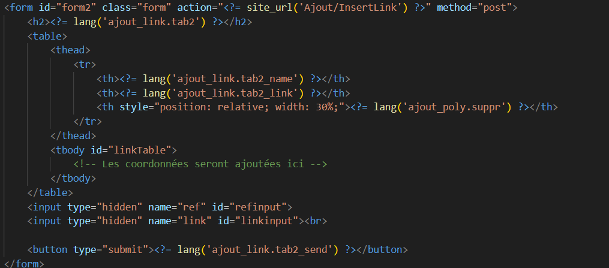

Le 2ème formulaire sert à stocker et afficher les liens à ajouter. Quand on clique sur validé du formulaire, il appelle la route "Ajout/InsertLink".

image::images/header_recit_view_7.png[route]

La route renvoie vers la méthode InsertLink du contrôleur Ajout.

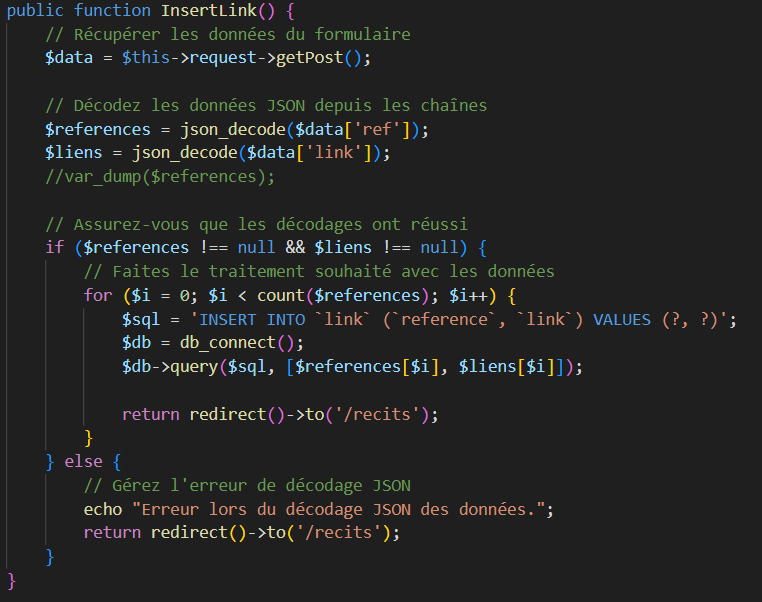

La méthode va insérer dans la table link les liens créés.

==== Api Zotero

image::images/header_recit_api_1.png[affichage]

L'api Zotero sera utilisée que dans la partie commentaire.

image::images/header_recit_api_2.png[js1]

Quand on clique sur un lien dans cette partie, il appelle la méthode afficherPopup dans le but d'afficher des informations détaillées de la source.

Pour cela on trouve l'api avec la clé et l'userid mais aussi une notification en haut à droite de l'écran pour informer l'utilisateur que la recherche est en cours.

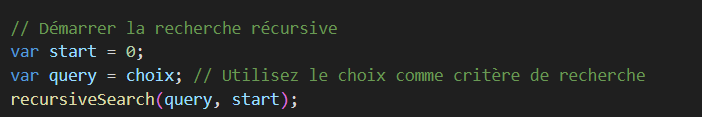

La fonction démarre avec start et query à 0 et appelle la méthode recursiveSearch avec ces paramètres.

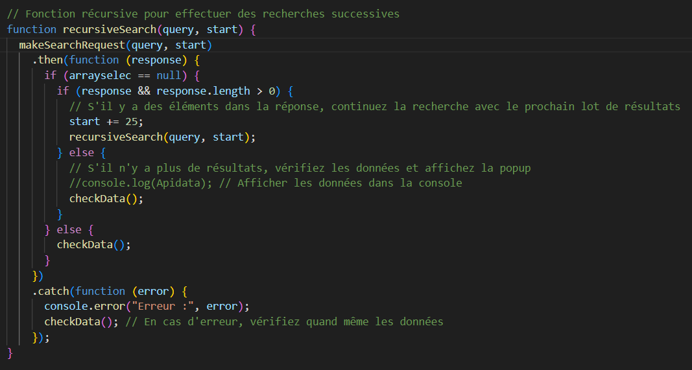

La fonction quant à elle va appeler la fonction makeSearchRequest avec les paramètres qu'elle a reçus. Puis à chaque résultat de cette fonction, elle va tester si la demande a été trouvée ou si il reste des éléments à rechercher dans l'api. Si il en reste, elle se rappelle avec le début de la recherche +25 éléments. Dans le cas où il n'y a plus d'élément ou il a été trouvé, elle appelle la fonction checkData.

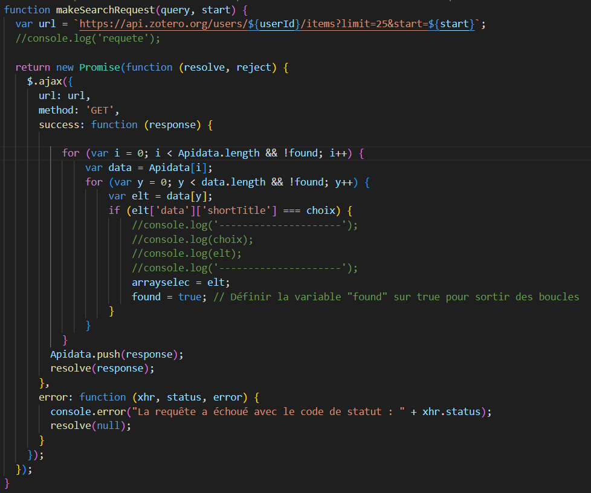

Cette fonction fait une requête de 25 éléments définis par la limite dans l'url de l'api et commence aux x ème éléments définis par le start reçu. Si elle trouve l'élément, elle va modifier la variable found à true ce qui va stopper les requêtes et faire l'affichage.

image::images/header_recit_api_6.png[js5]

Quand checkData est appelée, elle remplit les champs par le résultat récupéré.

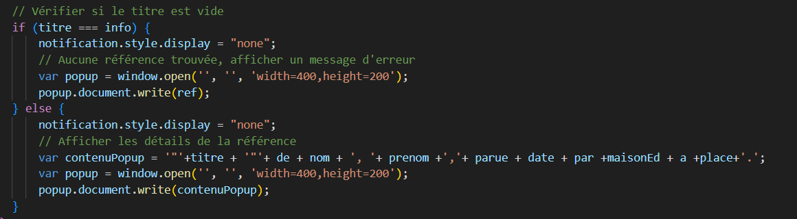

Puis si le titre est défini, elle affiche un popup avec les informations de la source et retire la notification de recherche. Mais si le titre n'est pas défini, elle fait un popup avec information non trouvée.

=== Statistique

Quand on clique sur statistique, on utilise la route.

image::images/header_stat_1.png[lien]

Cette route nous renvoie sur la méthode statistiques du contrôleur Admin.

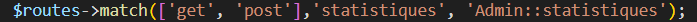

Le contrôleur va retourner les vues dans resclaves, statistique.php ainsi que le header.

image::images/header_stat_3.png[methode]

=== Langage

En haut à droite du site web, il est possible de changer la langue du site. Quand on choisit une langue, le code fait des requêtes pour remplacer tous les champs où l'on retrouve "lang()".

image::images/header_lang_1.png[code_trad]

Pour cela, il va chercher dans le fichier headergeo.php et il va chercher la ligne nav_bar.home ou nav_bar.list_narrative.

image::images/header_lang_2.png[trad]

Il existe la même chose pour le français. Cela permet d'avoir une traduction rapide et précise.

== Sidebar

image::images/sidebar.png[sidebar]

Dans la sidebar, on peut trouver plusieurs fonctionnalités :

=== Sélectionner un type de lieu

Le premier menu déroulant, où l'on peut rechercher par type de lieu, permet d'afficher tous les points du type demandé.

image::images/sidebar_formpoint_1.png[form]

On peut voir le formulaire avec plein de if. Cela permet de définir le type de point recherché. Puis la route est définie dans l'action du formulaire et non dans le bouton submit, mais le principe reste le même.

image::images/sidebar_formpoint_2.png[route]

La route nous indique que l'on va utiliser la méthode index de la classe Map, comme si on voulait revenir à la carte.

image::images/sidebar_formpoint_3.png[méthode]

Sauf que cette fois-ci, on ne va pas utiliser la dernière clause du if, mais la clause où select_place est défini. Notre formulaire va définir select_place avec une valeur, ce qui voudra dire que l'on a utilisé le formulaire. Suite à cela, le code va retourner les vues définies avec comme informations dans data, les points qui sont du type choisi ainsi que les territoires à afficher sur la carte.

=== Sélectionner un récit

Le deuxième menu déroulant est un menu où l'on peut choisir quel récit on veut afficher sur la carte.

image::images/sidebar_formrecit_1.png[form]

La route nous renvoie sur la méthode index du contrôleur Map.

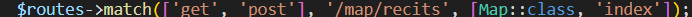

Et cette fois-ci, on va utiliser le premier if de la méthode, car le formulaire a défini select_recit.

image::images/sidebar_formrecit_3.png[méthode]

La méthode va retourner les vues demandées avec toutes les informations liées à un récit.

=== Menu de gestion

Dans le menu de gestion, il y a deux groupes de liens :

image::images/sidebar_gestionmenu.png[code]

Le premier groupe qui s'affiche seulement si l'utilisateur est connecté, et un deuxième où il affiche soit déconnexion quand on est connecté ou connexion quand on ne l'est pas.

=== Déconnecté

Commençons par le début, donc quand on arrive sur le site web, l'utilisateur est déconnecté.

==== Connexion

Pour se connecter, il faut cliquer sur le bouton suivant :

image::images/sidebar_gestionmenu_con_1.png[code]

Comme l'utilisateur n'est pas connecté, il utilisera la route `/connexion` :

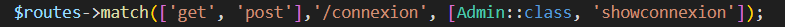

Cette route renvoie vers la méthode `showconnexion` du contrôleur `Admin` :

image::images/sidebar_gestionmenu_con_3.png[code]

La méthode renvoie la vue de connexion (`connexion.php`).

Sur la page de connexion, on peut remplir deux champs du formulaire (`username`, `password`) :

image::images/sidebar_gestionmenu_con_4.png[connexion]

Le formulaire enverra les données en utilisant sa route `/Admin/login` :

image::images/sidebar_gestionmenu_con_5.png[route]

Cette route mènera à la méthode `login` du contrôleur `Admin` :

image::images/sidebar_gestionmenu_con_6.png[connexion]

La méthode récupérera les champs du formulaire, hashera le mot de passe, et le comparera au mot de passe reçu dans la requête.

==== Ajout Point 

Dans le menu du sidebar.

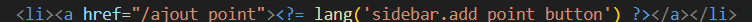

Lors du clic, il appelle la route /ajout_point.

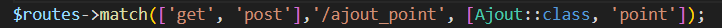

La route appelle la méthode point du contrôleur Ajout.

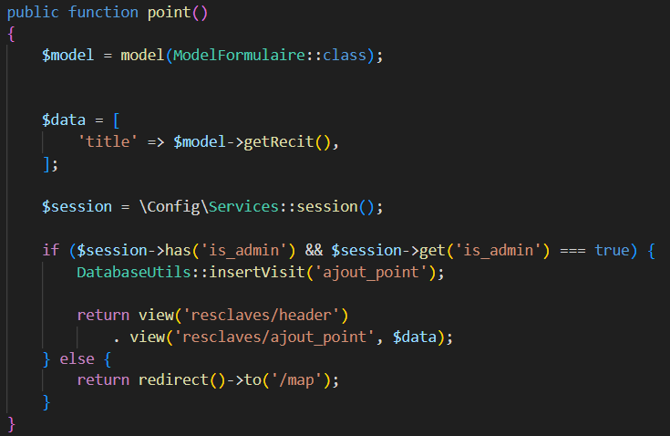

La méthode point affiche la page ajout_point.

image::images/sidebar_ajoup_4.png[page]

La page contient un formulaire avec des champs pour chaque attribut de la table point. Quand on valide le formulaire, on utilise la route Ajout/InsertPoint.

image::images/sidebar_ajoup_5.png[route]

La route appelle la méthode InsertPoint du contrôleur Ajout.

image::images/sidebar_ajoup_6.png[méthode]

La méthode récupère les champs du formulaire puis les insère dans la base de données.

==== Ajout Récit

On retrouve aussi un bouton pour ajouter un récit.

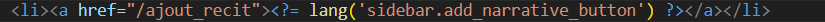

Il appelle la route "/ajout_recit".

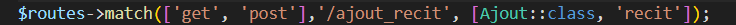

La route appelle la méthode recit du contrôleur Ajout.

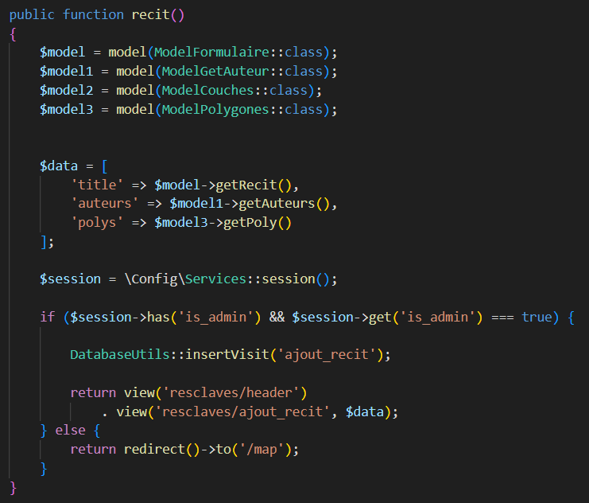

La méthode va afficher la page pour ajouter un formulaire ainsi qu'un menu déroulant avec tous les polygones dans la base de données.

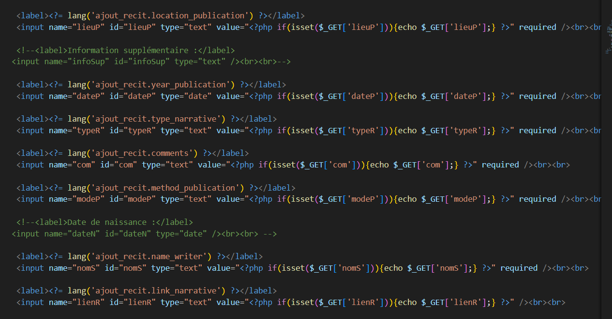

Puis la page va avoir un formulaire à remplir.

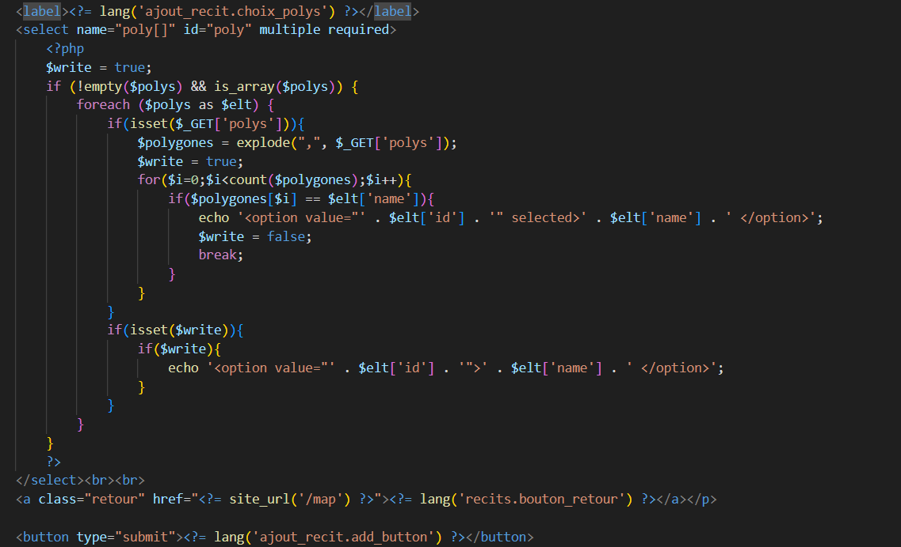

Et un menu déroulant avec tous les polygones de la base de données.

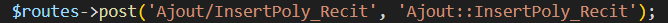

Quand on valide le formulaire, il va exécuter la route InsertPoly_Recit.

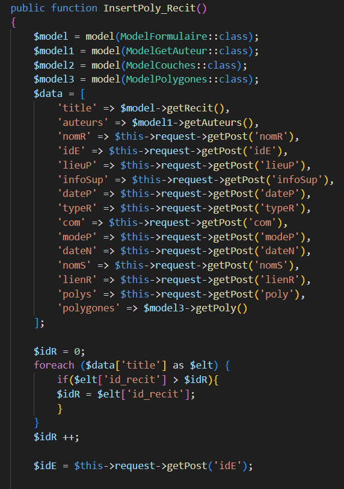

La méthode va récupérer les informations du formulaire.

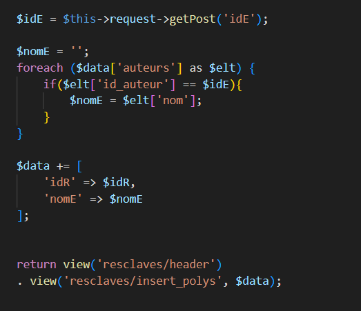

Puis rechercher l'id du récit et va retourner vers la page insert_poly, mais sans l'afficher.

Cette page va juste rassembler les informations pour l'appel de la méthode InsertRecit.

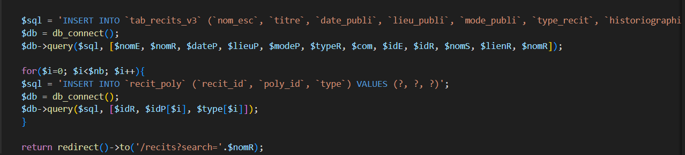

Cette méthode va insérer dans la base de données le récit ainsi que les liaisons entre le récit et les polygones.

==== Ajout Polygone

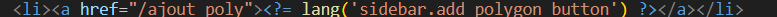

Quand on clique sur le bouton ajout polygone, il appelle la route "/ajout_poly".

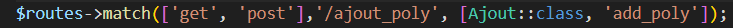

La route renvoie vers la méthode add_poly du contrôleur Ajout.

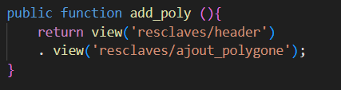

Cette méthode affiche la page ajout_polygone.

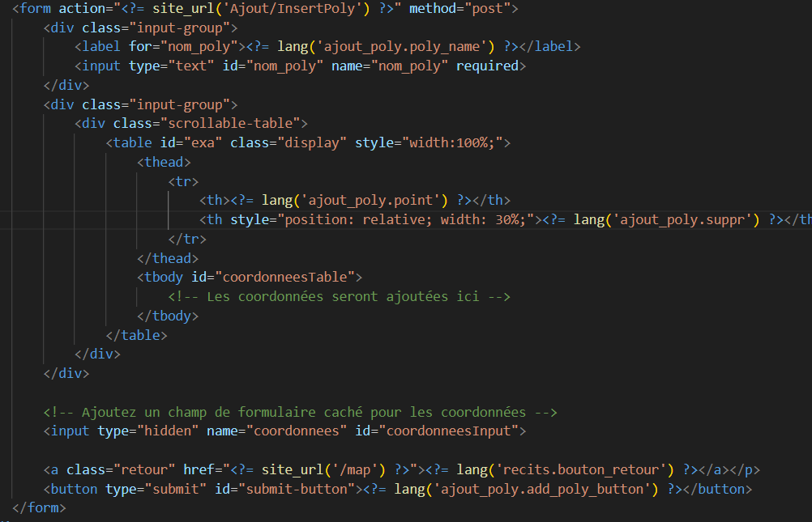

Cette page contient un tableau de points.

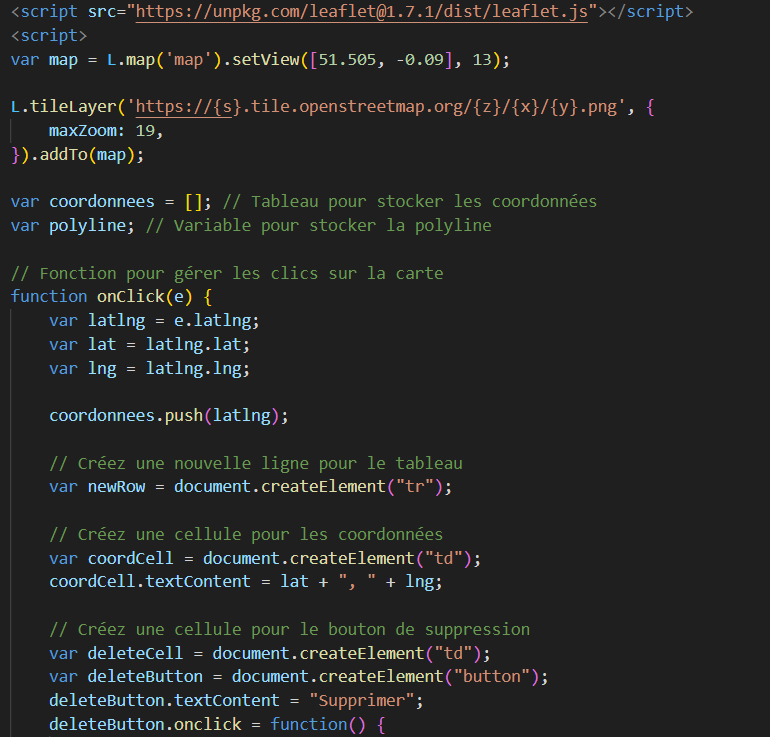

Ainsi que du JavaScript. Il y a une carte qui, quand elle est cliquée, ajoute un point dans le tableau. Si il y a plus de 2 points dans le tableau, il va dessiner un polygone.

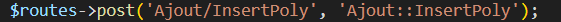

Puis, quand on valide le formulaire, il va chercher la méthode InsertPoly du contrôleur Ajout par la route.

image::images/sidebar_ajoutpol_7.png[méthode]

Cette méthode s'occupe de faire l'insertion dans la base de données du polygone créé.

==== Ajout Esclave/Auteur

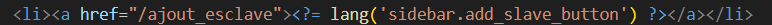

Quand on clique sur ajout d'un esclave, il appelle la route "/ajout_esclave".

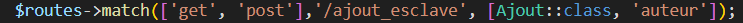

La route appelle la méthode auteur du contrôleur Ajout.

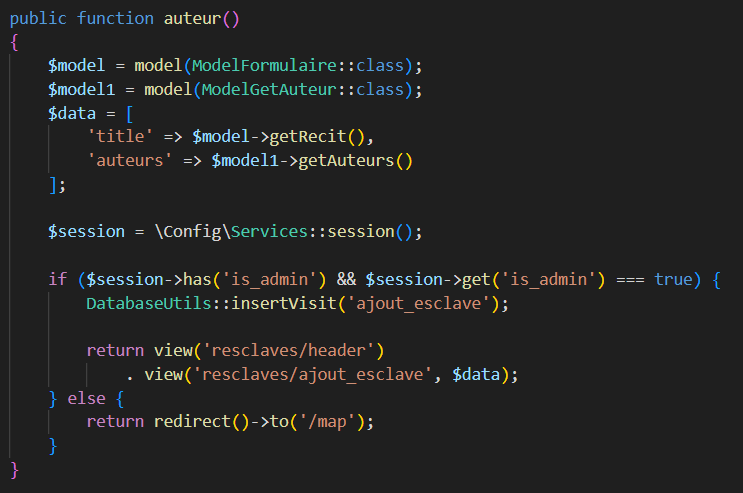

La méthode affiche la page ajout_esclave.

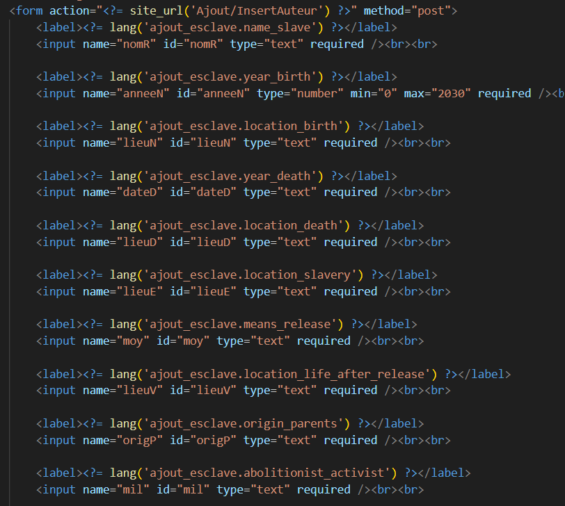

Dans cette page, on retrouve tous les champs pour ajouter un auteur.

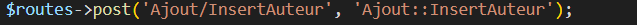

Quand on valide le formulaire, la route appelle la méthode InsertAuteur du contrôleur Ajout.

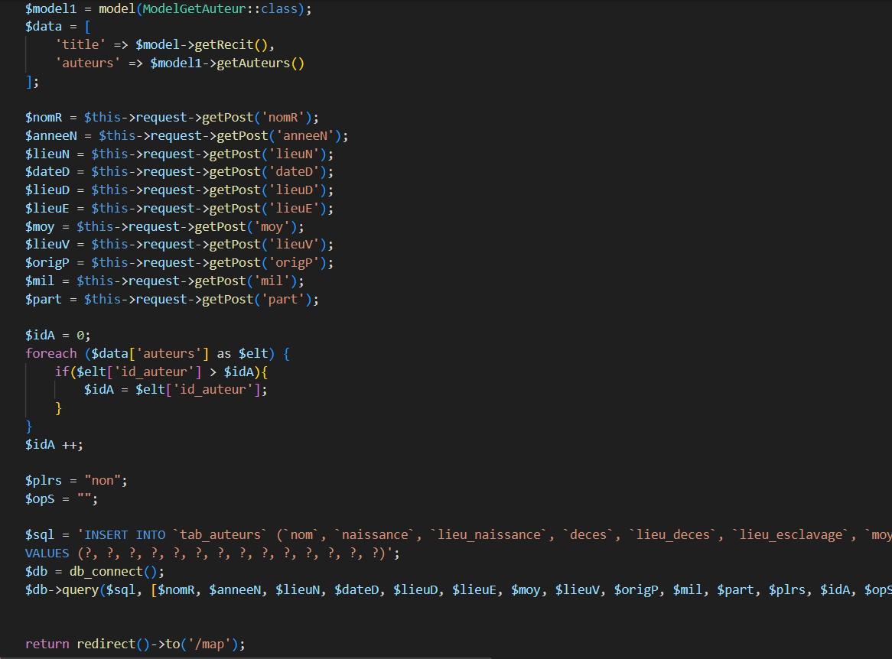

La méthode va insérer dans la base de données les informations remplies dans le formulaire.

==== Modification d'un Esclave/Auteur

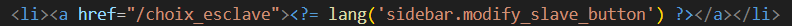

Quand on clique sur modif d'un esclave, il appelle la route "/choix_esclave".

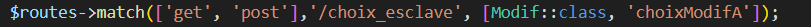

La route appelle la méthode choixModifA du contrôleur Modif.

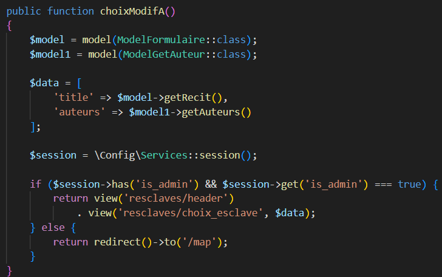

La méthode récupère tous les auteurs dans la base de données et affiche la page choix_esclave.

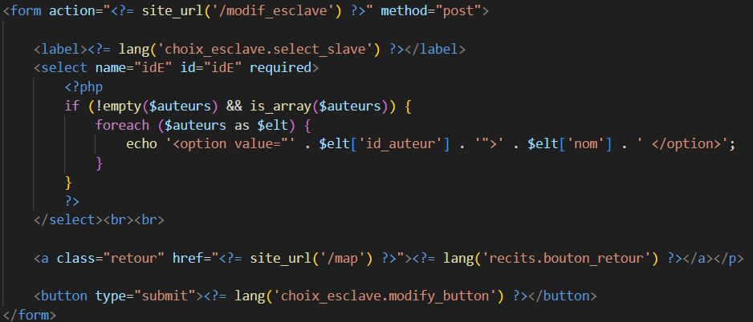

La page contient un formulaire avec un menu déroulant avec tous les auteurs, ce qui permet de choisir l'auteur.

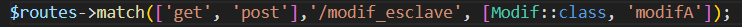

Le formulaire va appeler la route /modif_esclave et appeler la méthode modifA du contrôleur Modif.

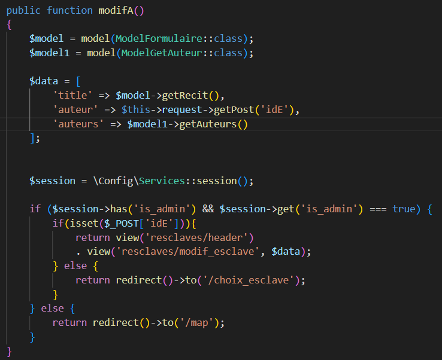

Cette méthode va récupérer toutes les informations liées à un auteur et afficher la page modif_esclave avec les informations récupérées.

image::images/sidebar_modifes_7.png[page]

Cette page contient un formulaire avec tous les champs à remplir pour la base de données, pré-remplis avec les informations récupérées.

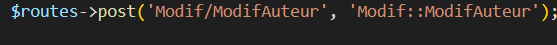

Quand le formulaire est validé, il va appeler la méthode ModifAuteur du contrôleur Modif.

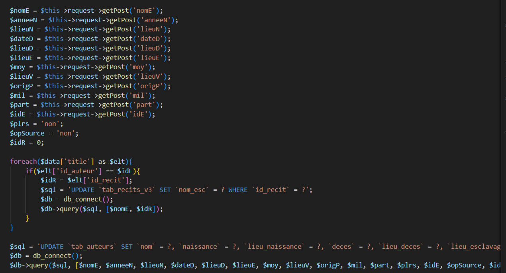

Cette méthode va mettre à jour l'auteur.

==== Suppression d'un Esclave/Auteur

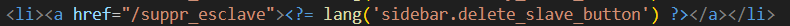

Quand on clique sur suppression d'un esclave, il appelle la route "/suppr_esclave".

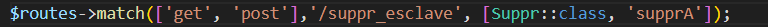

La route appelle la méthode supprA du contrôleur Suppr.

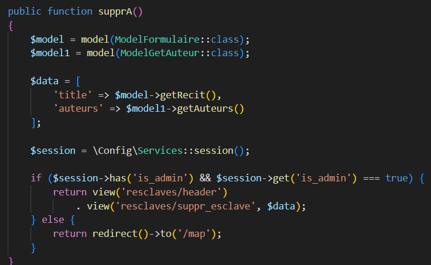

La méthode supprA récupère tous les auteurs dans la base de données et affiche la page suppr_esclave.

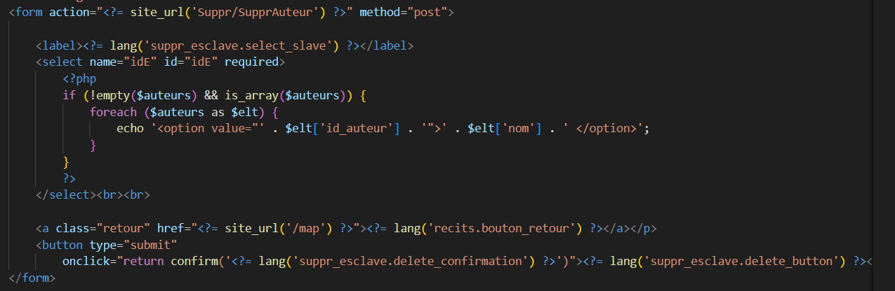

La page sert à choisir l'auteur à supprimer.

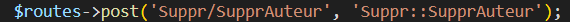

Une fois l'auteur sélectionné et le formulaire validé, la route appelle la méthode SupprAuteur du contrôleur Suppr.

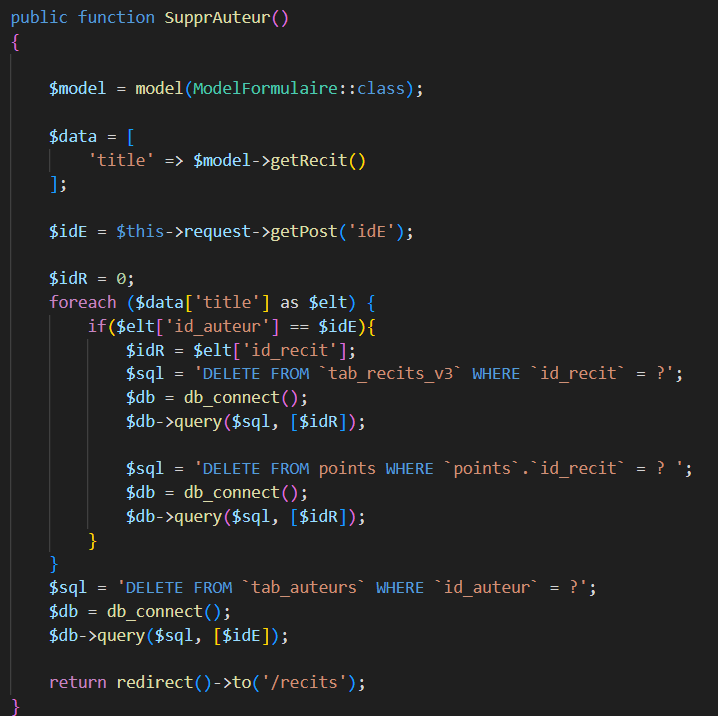

La méthode va supprimer l'auteur sélectionné précédemment.

== Footer

image::images/footer_1.png[footer]

Dans le footer, on retrouve deux fonctionnalités : le contact avec la possibilité d'envoyer un mail à l'adresse mail du site et une page avec des informations et remerciements.

image::images/footer_code_1.png[code]

=== Contacts

Dans la route, on appelle la méthode `contact` du contrôleur `Map`.

image::images/footer_contact_2.png[route]

Cette méthode retourne la page `contact`.

image::images/footer_contact_3.png[méthode]

Dans cette page, on retrouve un formulaire où l'on peut remplir les informations à transmettre dans le mail.

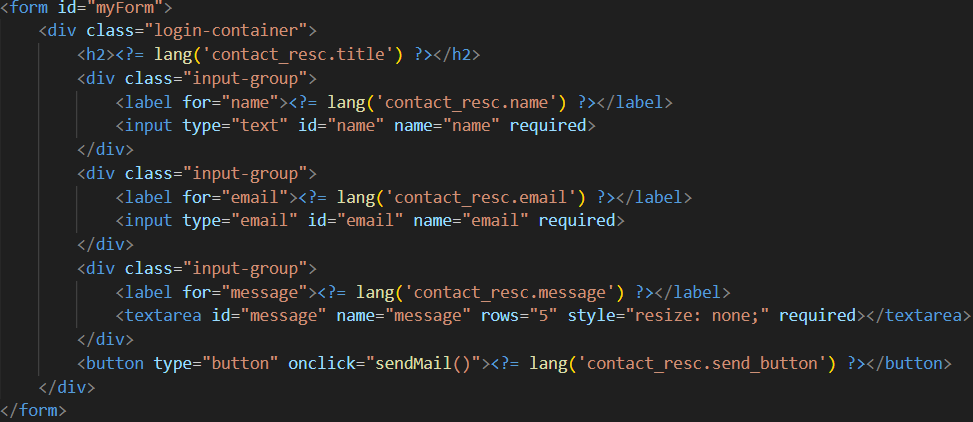

Mais on trouve aussi du JavaScript pour faire l'envoi du mail.

image::images/footer_contact_5.png[js]

Le premier bloc définit le service à utiliser par son identifiant.

image::images/footer_contact_8.png[js]

Et le deuxième bloc contient l'envoi du mail avec le template à utiliser. Le template permet de pré-structurer le mail avec les informations fournies.

image::images/footer_contact_6.png[js]

image::images/footer_contact_7.png[js]

=== Information

Pour les informations du site web :

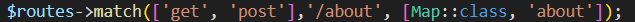

Le lien renvoie vers la méthode `about` du contrôleur `Map`.

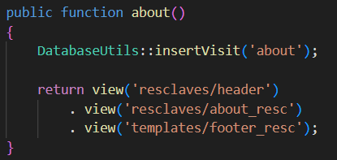

La page contient juste des informations et des remerciements.