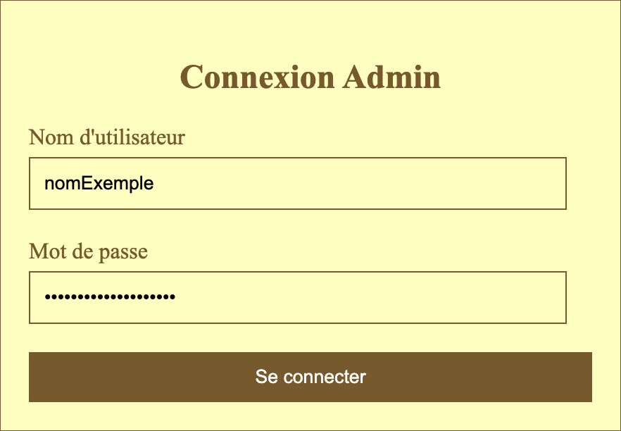

= Documentation Utilisateur site web Slave narratives
:toc: macro
:toc-title: Table des matières
:toclevels: 3

:hide-uri-scheme:   

== Introduction
Bienvenue sur notre site web ! Ce guide d'utilisation a été conçu pour vous aider à naviguer sur notre site et à en tirer le meilleur parti. Il vous expliquera comment accéder aux différentes sections et fonctionnalités, ainsi que les étapes à suivre pour effectuer des tâches courantes, telles que la création d'un compte ou la consultation d'un produit. Si vous rencontrez des problèmes ou des questions, n'hésitez pas à consulter notre section d'aide ou à nous contacter directement. Merci d'utiliser notre site !

toc::[]

== Accéder au site web

Afin d'accéder à notre site ouvrez votre navigateur web et saisissez (ou cliquer simplement sur) l'adresse suivante : https://slavenarrativessae.000webhostapp.com[Lien vers le site]

== Accueil

Lorsque vous êtes redirigé vers notre site vous arrivez sur la page d'accueil. 

=== Traduction du site

Vous pouvez traduire le site en anglais en cliquant sur le bouton `EN` en haut à droite de la page.

Cela aura pour effet de traduire le site en anglais.

image::images/traduction2.png[traduction2]

Vous pouvez également re traduire le site en français en cliquant sur le bouton `FR` en haut à droite de la page.

=== En-tête du site 

Vous pouvez accéder à tout moment à la page d'accueil en cliquant sur le bouton `Accueil` de notre site en haut à gauche de la page.

Vous pouvez également accéder à la liste des récits en cliquant sur le bouton `Liste des récits` de notre site 

image::images/boutonListeRécit.png[accueil3]

=== Liste des récits

Une fois sur la page de la liste des récits vous pourrez découvrir la liste des récits disponibles sur notre site.

Depuis cette page vous pouvez aussi accéder au détail du récit en cliquant sur le `nom de l'auteur` du récit. 

image::images/listeRécit2.png[listeRécit2]

=== Détail d'un récit

Une fois sur la page de détail d'un récit vous pourrez découvrir les informations relatives au récit sélectionné.

image::images/détailRécit.png[détailRécit]

==== Information supplémentaire sur un récit

Vous pouvez accéder à des informations supplémentaires sur le récit en cliquant sur le titre simplifié du récit.

Cela aura pour effet de faire apparaître une fenêtre contenant des informations supplémentaires sur le récit.

=== Recherche d'un type de lieu    

Vous pouvez rechercher un type de lieu en sélectionnant un type de lieu dans la liste déroulante `Rechercher un type de lieu` 

image::images/listeDeroul.png[rechercheTypeLieu]

Puis en cliquant sur le bouton `Rechercher`.

Cela aura pour effet d'afficher les différents lieux correspondant au type de lieu sélectionné.

=== Recherche un récit

Vous pouvez rechercher un récit en sélectionnant un récit dans la liste déroulante `Rechercher un récit`

image::images/listeDeroul2.png[rechercheRécit]

Puis en cliquant sur le bouton `Rechercher`.

image::images/rechercheRécit.png[rechercheRécit2]

Cela aura pour effet de mettre en valeur les différents lieux liée au récit sélectionné.

image::images/lieuRécit.png[lieuRécit]

Vous pourrez également accéder à la fiche du récit en cliquant sur le lien `Voir la fiche du récit`.

image::images/lienFicheRécit.png[lienFicheRécit]

=== Légende de la carte

Une légende est présente en bas à droite de la carte. Elle vous permet de savoir à quoi correspond les différents points et lieux sur la carte.

image::images/légende.png[légende]

=== Pied de page du site

Le pied de page contient des liens vers les pages tel que `A propos`, `Contact` (mettre lien vers explication page)

image::images/piedPage.png[pied de page]

==== À propos

Cette page permet d'avoir des informations sur le site et sur les personnes qui ont travaillé dessus.

image::images/àPropos.png[à propos]

==== Contact

Lorsque vous cliquez sur le bouton de `contact`, vous pouvez remplir le formulaire avec votre nom, email et le message que vous voulez envoyer. Il sera directement envoyé au propriétaire du site.

== Partie Administrateur

=== Création d'un compte

Si vous souhaitez créer un compte, vous devez cliquer sur le bouton `Ouvrir le menu` puis en cliquant sur le bouton `Créer un compte` à droite de la page.

image::images/créerCompte.png[connexion]

Vous arrivez alors sur la page de création de compte. Il vous suffit de saisir votre identifiant, votre mot de passe puis de cliquer sur le bouton `Créer le compte`.

image::images/créerCompte2.png[connexion2]

Le compte sera alors créé et sécurisé dans la base de données du site.

image::images/créerCompte3.png[connexion3]

=== Connexion

Pour accéder à la partie administrateur vous devez vous connecter en cliquant sur le bouton `Ouvrir le menu` puis en cliquant sur le bouton `Connexion` à droite de la page.

image::images/connexion.png[connexion]

Vous arrivez alors sur la page de connexion. Il vous suffit de saisir votre identifiant et votre     mot de passe puis de cliquer sur le bouton `Connexion`.

Une fois la connexion effectuée vous serez redirigé vers la page d'accueil mais avec quelques ajouts. Un ajout sur le titre du site sera visible avec le mot `Administrateur` afin de vous indiquer que vous êtes bien connecté.

image::images/adminAccueil.png[connexionTitle]

Dans cette partie administrateur, le menu du site a également changé, avec en plus un onglet `statistiques`.

=== Statistiques

En cliquant sur le bouton `Statistiques`, vous serez redirigé vers une page de statistiques. On y trouve 4 graphiques qui représentent le nombre de visite des pages, nombre de visite par année, par mois et par jour avec la possibilité de choisir le jour à voir.

=== Déconnexion

Vous aurez également accès à un bouton `Déconnexion` en ouvrant le menu déroulant à droite de la page.

Ce bouton vous permettra de vous déconnecter de la partie administrateur.

image::images/déconnexion.png[déconnexion]

====
*La déconnexion peut ne pas marcher si le navigateur que vous utilisez est Firefox.*
====

=== Liste des récits (Administrateur)

En tant qu'administrateur vous aurez accès à un bouton de modification et de suppression de récit sur la page de la liste des récits.

image::images/listeRécitAdmin.png[listeRécitAdmin]

=== Ajout d'un point

De plus, vous aurez accès à un bouton `Ajout d'un point` en ouvrant le menu déroulant à droite de la page.

image::images/ajoutPointBout.png[ajoutPoint]

Vous serez alors redirigé vers la page d'ajout d'un point. Il vous faudra donc saisir les informations demandées afin d'ajouter un point sur la carte.

image::images/formAjoutPoint.png[ajoutPoint2]

==== Ajout d'un point (Coordonnées)

Tout d'abord il vous faudra saisir les coordonnées du point que vous souhaitez ajouter. Pour cela vous devrez cliquer sur l'endroit où vous souhaitez ajouter le point, sur la carte en dessous du formulaire.

image::images/carteAjoutPoint.png[ajoutPoint3]

Cela aura pour effet d'entrer automatiquement les coordonnées du point dans le champ `Coordonnées` de la page d'ajout d'un point.

==== Ajout d'un point (Ville) 

Vous devrez ensuite saisir la ville dans le champ `Ville` de la page d'ajout d'un point.    

image::images/formAjoutPoint3.png[ajoutPoint6]

==== Ajout d'un point (Type de point)

Vous devrez ensuite sélectionner le type de point que vous souhaitez ajouter dans la liste déroulante `Type de point` de la page d'ajout d'un point.

image::images/formAjoutPoint4.png[ajoutPoint7]

==== Ajout d'un point (Joindre à un récit)

Vous pourrez ensuite sélectionner un récit dans la liste déroulante `Joindre à un récit` de la page d'ajout d'un point.

Il ne vous reste plus qu'à cliquer sur le bouton `Terminer` afin d'ajouter le point sur la carte. 

Le point sera alors visible sur la carte.

image::images/pointAjouté.png[ajoutPoint9]

=== Ajout d'un récit

Si vous souhaitez ajouter un récit, vous devez cliquer sur le bouton `Ajout d'un récit` en ouvrant le menu déroulant à droite de la page.

image::images/ajoutRécitBout.png[ajoutRécit]

Vous serez alors redirigé vers la page d'ajout d'un récit. Il vous faudra donc saisir les informations demandées afin d'ajouter un récit sur le site dont : 

* Le nom du récit
* Le nom de l'esclave
* Le lieu de publication
* L'année de publication
* Le type de récit
* Commentaires / Historiographie
* Mode de publication
* Nom du scribe / écrivain 
* Lien vers le récit
* Territoires liées au récit

image::images/formAjoutRécit0.png[ajoutRécit2]
image::images/formAjoutRécit1.png[ajoutRécit3]

Puis cliquer sur le bouton `Ajouter` afin d'ajouter le récit sur le site.

==== Ajout d'un récit (Ajout d'un lien)

Vous avez également la possibilité d'ajouter un lien vers le récit en cliquant tout d'abord sur le bouton `Liste de récits` en haut de la page.

image::images/boutonListeRécit.png[ajoutRécit4]

Puis en cliquant sur le récit de votre choix dans la liste des récits.

image::images/listeRécit2.png[ajoutRécit5]

Et enfin en cliquant sur le bouton `Ajouter un lien` dans le résumé du récit.

Vous serez alors redirigé vers la page d'ajout d'un lien. Il vous faudra donc saisir les informations demandées afin d'ajouter un lien vers le récit sur le site dont :

* Le nom du lien
* Le lien

Le lien ajouté sera alors visible dans le tableau à droite du formulaire avec un bouton pour le supprimer en cas d'erreur de saisie. 

Pour confirmer l'ajout du lien il vous faudra cliquer sur le bouton `Stocker les liens` en bas du tableau.
Cela aura pour effet de stocker les liens dans la base de données du site.

=== Ajout d'un polygone

Si vous souhaitez ajouter un polygone, vous devez cliquer sur le bouton `Ajout d'un polygone` en ouvrant le menu déroulant à droite de la page.

Vous serez alors redirigé vers la page d'ajout d'un polygone. Il vous faudra donc saisir les informations demandées afin d'ajouter un polygone sur la carte dont : 

* Le nom du polygone
* Le type de polygone

image::images/formAjoutPolygone2.png[ajoutPolygone3]

==== Ajout d'un polygone (Liste des points)

Vous devrez ensuite sélectionner les points qui composent le polygone dans la carte en dessous du formulaire.

La liste des points sélectionnés sera alors visible dans la liste déroulante `Liste des points` et il sera aussi possible de les supprimer. 

=== Ajout d'un esclave/auteur

Si vous souhaitez ajouter un esclave/auteur, vous devez cliquer sur le bouton `Ajout d'un esclave/auteur` en ouvrant le menu déroulant à droite de la page.

Vous serez alors redirigé vers la page d'ajout d'un esclave/auteur. Il vous faudra donc saisir les informations demandées afin d'ajouter un esclave/auteur sur le site dont :

* Le nom de l'esclave
* L'année de naissance
* Le lieu de naissance
* L'année de décès
* Le lieu de décès
* Le lieu d'esclavage
* Le moyen de libération 
* Le lieu de vie après libération 
* L'origine des parents
* Si il est militant abolitionniste ou non
* Les particularités de l'esclave

Puis cliquer sur le bouton `Ajouter` afin d'ajouter l'esclave/auteur sur le site.

=== Modification d'un esclave/auteur

Si vous souhaitez modifier un esclave/auteur, vous devez cliquer sur le bouton `Modification d'un esclave/auteur` en ouvrant le menu déroulant à droite de la page.

Vous serez alors redirigé vers la page de modification d'un esclave/auteur. Il vous faudra donc selectionner l'esclave que vous souhaitez modifier dans la liste déroulante `Selectionner un esclave à modifier`.

Vous pourrez ensuite modifier les informations de l'esclave/auteur que vous souhaitez modifier.

=== Suppression d'un esclave/auteur

Si vous souhaitez supprimer un esclave/auteur, vous devez cliquer sur le bouton `Suppression d'un esclave/auteur` en ouvrant le menu déroulant à droite de la page.

Vous serez alors redirigé vers la page de suppression d'un esclave/auteur. Il vous faudra donc selectionner l'esclave que vous souhaitez supprimer dans la liste déroulante `Selectionner un esclave à supprimer`.

